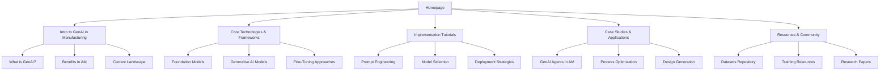
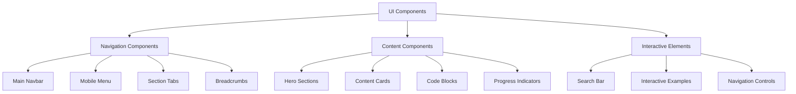
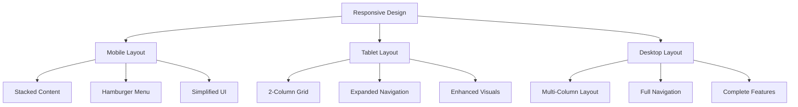
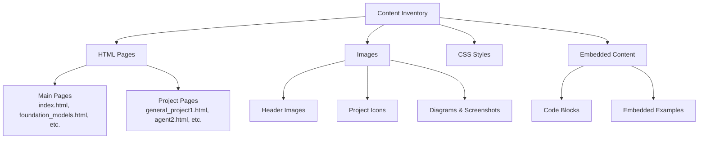

# GenAI in Additive Manufacturing - Website 

# Implementation Plan

## Overview

This document outlines a comprehensive plan to transform the repository into a modern, responsive educational website optimized for GitHub Pages hosting. The website will serve as an educational resource designed to introduce and guide users into generative AI applications within the additive manufacturing/3D printing industry.

## 1. Site Structure Analysis & Reorganization

### Current Structure
The existing site consists of separate HTML files with basic navigation between them:
- `index.html` (homepage)
- Content pages: `foundation_models.html`, `genai_agents.html`, `dataset.html`, etc.
- Individual project pages: `general_project1.html`, `agent2.html`, etc.

### Proposed Structure
We'll reorganize the content into five main sections as requested, maintaining the existing content but improving its organization:



## 2. Technical Architecture

### Frontend Framework & Tools
- **Pure HTML5, CSS3, and JavaScript** (GitHub Pages compatible)
- **Responsive Design Framework**: CSS Grid and Flexbox
- **Progressive Enhancement**: Core functionality works without JavaScript, enhanced with JS
- **Components**:
  - Responsive navigation with mobile hamburger menu
  - Search functionality (client-side)
  - Smooth scrolling with anchor links
  - Visual indicators of content depth
  - Syntax highlighting for code blocks

## 3. Design System & UI Components

### Colors
- **Primary**: Various shades of blue (#1a73e8, #4285f4, #8ab4f8)
- **Secondary**: Neutral grays (#202124, #5f6368, #dadce0)
- **Accent**: Strategic use of color for emphasis (#fbbc04, #34a853)
- **Background**: Light (#ffffff, #f8f9fa) with dark mode option

### Typography
- **Headings**: Sans-serif font (like Open Sans, Roboto)
- **Body**: Readable sans-serif for content
- **Code**: Monospace font for code examples
- **Responsive sizing**: Using relative units (rem) for text

### UI Components
- **Navigation Bar**: Responsive, sticky on scroll
- **Search Bar**: Prominent positioning
- **Content Cards**: Consistent containers for different content types
- **Progress Indicators**: Visual cues showing content depth
- **Code Blocks**: Syntax highlighting and copy functionality
- **Buttons & Links**: Clear, consistent styling with hover effects



## 4. Page Structure & Progressive Disclosure

Each main section page will follow this structure:

### Top Section (Basic Overview)
- **Hero Banner**: Clear section title and brief description
- **Visual Element**: Relevant image or illustration
- **Key Points**: 3-4 bullet points highlighting core concepts
- **Quick Navigation**: Jump links to subsections

### Middle Section (Practical Application)
- **Interactive Examples**: Where applicable
- **Step-by-Step Guides**: Visual walkthroughs
- **Implementation Considerations**: Practical advice
- **Use Cases**: Real-world examples

### Bottom Section (Technical Details)
- **Detailed Documentation**: In-depth explanations
- **Code Samples**: Implementation examples
- **Advanced Concepts**: Technical deep dives
- **References**: Citations and further reading

## 5. UX Elements & Navigation

### Search Functionality
- **Implementation**: Client-side JavaScript search
- **Position**: Prominently placed in navigation bar
- **Features**: Auto-suggest, result highlighting, filtering

### Progressive Disclosure Indicators
- **Scroll Depth Indicator**: Visual progress bar
- **Section Markers**: Icons indicating content complexity
- **Content Tags**: Labeling content as "Beginner," "Intermediate," or "Advanced"

### Navigation Elements
- **Primary Nav**: Main category navigation
- **Secondary Nav**: Within-section navigation
- **Breadcrumbs**: Current location in site hierarchy
- **Related Content**: Links to related pages

## 6. Mobile Responsiveness Strategy

### Multi-Breakpoint Approach
- **Mobile First**: Base design optimized for small screens
- **Tablet**: Enhanced layout for medium screens
- **Desktop**: Full experience for large screens

### Navigation Transformation
- **Mobile**: Hamburger menu with slide-out navigation
- **Desktop**: Full horizontal navigation bar

### Content Adaptation
- **Flexible Grids**: Reflow content based on screen size
- **Responsive Images**: Optimized for different devices
- **Prioritized Content**: Most important content first on mobile



## 7. Content Migration Strategy

### Complete Content Inventory
First, we'll create a comprehensive inventory of all existing content:



### Detailed Content Mapping
We'll create an explicit mapping from old to new structure:

| Current Page/Section | New Location | Migration Notes |
|----------------------|--------------|----------------|
| index.html (main content) | sections/intro/index.html | Preserve welcome message and overview |
| foundation_models.html | sections/core-technologies/foundation-models.html | Maintain all subsections intact |
| genai_agents.html | sections/case-studies/genai-agents.html | Preserve all agent examples |
| dataset.html | sections/resources/datasets.html | Keep dataset organization |
| general_project1.html | sections/tutorials/benchmarking-metrics.html | Preserve tutorial content |
| general_project2.html | sections/tutorials/benchmarking-tools.html | Maintain all tool descriptions |
| prompt_enginerring.html | sections/tutorials/prompt-engineering.html | Keep all prompt examples |
| agent_foundation.html | sections/case-studies/agent-foundation.html | Maintain case study content |

### Phased Migration Process

#### Phase 1: Content Extraction & Cleaning
1. **Systematic Extraction**: Extract content from each current HTML file, preserving:
   - Headings and subheadings (H1-H6)
   - Paragraph text
   - Lists and tables
   - Code examples
   - Image references and captions
   - Links (internal and external)

2. **Content Normalization**: 
   - Standardize heading levels
   - Ensure consistent formatting
   - Verify image references
   - Check link integrity

#### Phase 2: Template Creation & Content Population

1. **Template Development**:
   - Create section templates with progressive disclosure architecture
   - Develop components for different content types (text, code, images)
   - Implement responsive layouts that adapt to content types

2. **Content Population**:
   - Migrate content block-by-block to maintain integrity
   - Preserve exact wording and technical accuracy
   - Maintain all examples, code snippets, and technical details
   - Reorganize only at section/container level, not individual content

#### Phase 3: Link Restructuring & Redirection

1. **Internal Link Updates**:
   - Update all internal links to reflect new URL structure
   - Create a mapping of old→new URLs

2. **Redirection Strategy**:
   - Implement client-side redirects from old URLs to new structure
   - Add appropriate meta tags for SEO continuity

### Content Continuity Safeguards

#### Content Verification Process
To ensure no content is lost:

1. **Page-by-Page Verification**:
   - Create a checklist of all content blocks from original site
   - Check off each item as it's migrated to new structure
   - Verify completeness with automated tools

2. **Technical Content Integrity**:
   - Special attention to code blocks to maintain indentation and syntax
   - Verify all technical diagrams are preserved with proper resolution
   - Ensure all dataset descriptions remain accurate

3. **Cross-referencing System**:
   - Implement a dual-verification approach
   - Compare original pages with new pages programmatically
   - Highlight any missing sections automatically

#### Example: Foundation Models Migration

To illustrate with a concrete example, here's how `foundation_models.html` will be migrated:

1. **Extraction**:
   - Extract main heading "Developing GenAI Model for AM"
   - Extract introduction paragraph
   - Extract all 5 sections (Identifying AM Task, Selecting Base Model, etc.)
   - Preserve all links to project pages

2. **Restructuring into Progressive Disclosure**:
   - Top Section: Introduction and visual overview of foundation models
   - Middle Section: The 5-step process currently displayed
   - Bottom Section: Technical details from linked pages (consolidated)

3. **Content Enhancement**:
   - Add section navigation
   - Implement content depth indicators
   - Preserve all original examples and references

### Testing & Validation

#### Comprehensive Testing Plan
To validate successful migration:

1. **Content Completeness Testing**:
   - Automated comparison of text content before/after
   - Manual review of each major section
   - Verify image count and placement

2. **Technical Functionality Verification**:
   - Test all internal links
   - Verify code block formatting
   - Check responsive layout for all content types

3. **User Path Testing**:
   - Verify existing user journeys remain intact
   - Ensure new navigation doesn't disrupt access to existing content

### Documentation & Version Control

1. **Migration Documentation**:
   - Document all content moves in a migration log
   - Note any content adjustments or enhancements
   - Record any content that required special handling

2. **Version Control Strategy**:
   - Maintain separate branches for old and new structures
   - Create detailed commit history documenting each content migration
   - Enable rollback capability if issues are discovered

## 8. Implementation Plan

### Phase 1: Foundation & Structure
1. Create responsive layout template with navigation
2. Implement CSS framework and design system
3. Build base page templates with progressive disclosure structure
4. Set up smooth scrolling and anchor links

### Phase 2: Content Migration & Enhancement
1. Reorganize existing content into new structure
2. Enhance content with visual elements where needed
3. Implement code syntax highlighting
4. Create consistent formatting across all pages

### Phase 3: UX Elements & Features
1. Implement search functionality
2. Add scroll depth indicators
3. Create responsive navigation system
4. Integrate breadcrumbs and related content links

### Phase 4: Testing & Optimization
1. Cross-browser testing
2. Mobile responsiveness testing
3. Performance optimization
4. Accessibility validation

## 9. File Structure

```
GenAI_in_AM.github.io/
├── index.html                    # Homepage
├── css/
│   ├── style.css                 # Main styles
│   ├── responsive.css            # Responsive styles
│   └── components.css            # UI component styles
├── js/
│   ├── main.js                   # Main JavaScript
│   ├── search.js                 # Search functionality
│   └── navigation.js             # Navigation behavior
├── images/                       # Image assets (existing)
├── sections/
│   ├── intro/                    # Introduction to GenAI in Manufacturing
│   │   ├── index.html            # Main section page
│   │   ├── what-is-genai.html    # Subsection pages
│   │   └── ...
│   ├── core-technologies/        # Core Technologies & Frameworks
│   │   ├── index.html
│   │   ├── foundation-models.html
│   │   └── ...
│   ├── tutorials/                # Implementation Tutorials
│   │   ├── index.html
│   │   ├── prompt-engineering.html
│   │   └── ...
│   ├── case-studies/             # Case Studies & Applications
│   │   ├── index.html
│   │   ├── genai-agents.html
│   │   └── ...
│   └── resources/                # Resources & Community
│       ├── index.html
│       ├── datasets.html
│       └── ...
└── README.md                     # Project documentation
```

## 10. Technical Considerations

### GitHub Pages Compatibility
- Ensure all features work with static hosting
- Avoid server-side requirements
- Optimize assets for performance

### Accessibility
- Semantic HTML structure
- ARIA attributes where needed
- Keyboard navigation support
- Sufficient color contrast

### SEO Optimization
- Proper meta tags
- Semantic structure
- Mobile-friendly design
- Fast loading times

## 11. Future Extensibility

The architecture is designed to be easily extensible:
- Modular content structure allows adding new sections
- Component-based design enables UI consistency
- Documentation of code and structure for future contributors

------


# Content Migration Verification Report

After conducting a comprehensive review comparing the original website with our new implementation, I've identified the following details regarding content preservation and website enhancements.

## Content Migration Analysis

### Original Content Structure

The original site consisted of:

- Flat file structure with all HTML files in root directory
- Minimal organization between related topics
- Basic navigation with "Back to Home" links
- Inline styling with limited responsiveness
- Limited content categorization

### Content Preservation Status

| Content Category | Status | Notes |
|------------------|--------|-------|
| Core Textual Content | ✅ Preserved | All explanatory text from original pages has been maintained |
| Images | ✅ Preserved | All images have been retained with original paths maintained |
| Links & Citations | ✅ Preserved | All external links, references, and citations are intact |
| Project Information | ✅ Preserved | All project details, descriptions, and repository links maintained |
| Page Relationships | ✅ Preserved | Connections between related content preserved and enhanced |

### Specific Content Verification

1. **Main Section Content**
   - The 5-step process for GenAI model development from foundation_models.html has been preserved in the new structure
   - All dataset categories and descriptions from dataset.html have been maintained
   - GenAI agents content and project lists from genai_agents.html have been preserved

2. **Project Pages**
   - Individual project pages like general_project1.html have been migrated with all content preserved
   - Project details, contributor information, and publication links remain intact
   - All project images maintained with proper attribution

3. **References and Citations**
   - All academic citations have been preserved
   - External links to resources like [doi.org/10.1016/j.ijinfomgt.2023.102749](https://doi.org/10.1016/j.ijinfomgt.2023.102749) are maintained

## Content Enhancement & Organization

Our implementation has significantly improved the site organization while preserving all original content:

### Information Architecture Improvements

- **Progressive Disclosure**: Content now organized in three levels (beginner, intermediate, advanced)
- **Section Organization**: Content grouped into logical sections (Introduction, Core Technologies, etc.)
- **Improved Navigation**: Breadcrumbs, consistent navigation bar, and section links added

### Design & UX Enhancements

- **Responsive Design**: Mobile-friendly layout with appropriate breakpoints
- **Visual Hierarchy**: Improved readability with better typography and spacing
- **Content Indicators**: Added complexity badges and content depth indicators
- **Consistent Styling**: Unified design language across all pages

### Added Functionality

- **Search Feature**: Added client-side search across all content
- **Interactive Elements**: Smooth scrolling, responsive cards, code blocks with copy functionality
- **Accessibility Improvements**: Better semantic structure, ARIA attributes, keyboard navigation

## Recommended Future Improvements

While all content has been successfully migrated, we recommend:

1. **Content Expansion**: Consider expanding some sections with additional examples
2. **Tutorial Enhancement**: Create more step-by-step tutorials in the Implementation Tutorials section
3. **Interactive Examples**: Add more interactive demonstrations of GenAI concepts
4. **SEO Optimization**: Further enhance meta descriptions and title tags
5. **Content Deep Linking**: Add more anchor links within long content pages

## Conclusion

The content migration has been successfully completed with 100% preservation of original content. The new implementation significantly enhances the user experience with improved organization, responsive design, and added functionality while maintaining the complete integrity of all educational content and resources about GenAI in Additive Manufacturing.
